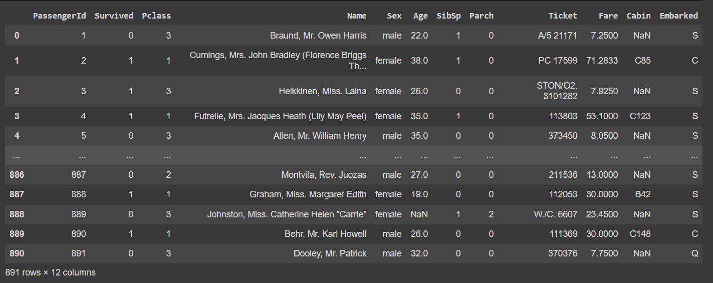
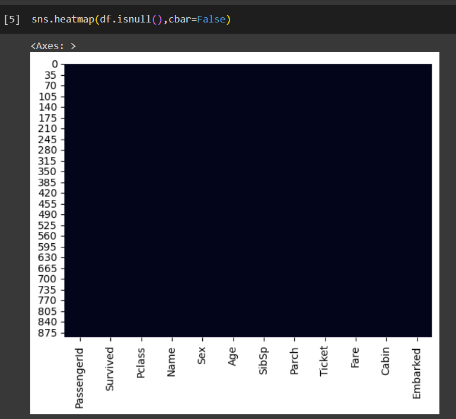
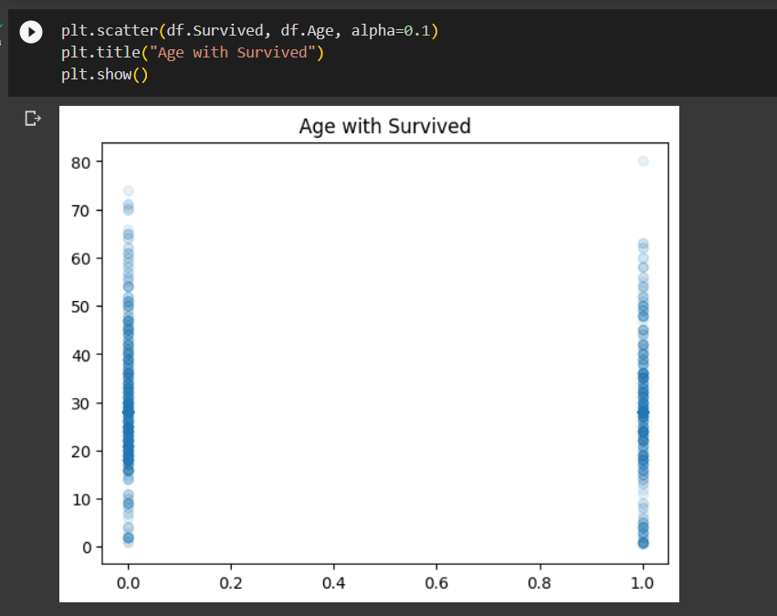

# Ex-07-Feature-Selection
## AIM
To Perform the various feature selection techniques on a dataset and save the data to a file. 

# Explanation
Feature selection is to find the best set of features that allows one to build useful models.
Selecting the best features helps the model to perform well. 

# ALGORITHM
### STEP 1
Read the given Data
### STEP 2
Clean the Data Set using Data Cleaning Process
### STEP 3
Apply Feature selection techniques to all the features of the data set
### STEP 4
Save the data to the file


# CODE
```python
#Developed by :Shakthi kumar S
#Register number :212222110043

import pandas as pd
import numpy as np
import seaborn as sns
import pandas as pd
import matplotlib.pyplot as plt

df = pd.read_csv('titanic_dataset.csv')
df

df.isnull().sum()
df.describe()

sns.heatmap(df.isnull(),cbar=False)

df['Age'] = df['Age'].fillna(df['Age'].dropna().median())
df['Fare'] = df['Fare'].fillna(df['Fare'].dropna().median())
df.loc[df['Sex']=='male','Sex']=0
df.loc[df['Sex']=='female','Sex']=1
df['Embarked']=df['Embarked'].fillna('S')

df.loc[df['Embarked']=='S','Embarked']=0
df.loc[df['Embarked']=='C','Embarked']=1
df.loc[df['Embarked']=='Q','Embarked']=2

drop_elements = ['Name','Cabin','Ticket']
df = df.drop(drop_elements, axis=1)
df.head(15)

f,ax = plt.subplots(figsize=(5, 5))
sns.heatmap(df.corr(), annot=True, linewidths=.5, fmt= '.1f',ax=ax)

sns.heatmap(df.isnull(),cbar=False)

fig = plt.figure(figsize=(18,6))
df.Survived.value_counts(normalize=True).plot(kind='bar',alpha=0.5)
plt.show()

plt.scatter(df.Survived, df.Age, alpha=0.1)
plt.title("Age with Survived")
plt.show()

fig = plt.figure(figsize=(18,6))
df.Pclass.value_counts(normalize=True).plot(kind='bar',alpha=0.5)
plt.show()

from sklearn.feature_selection import SelectKBest
from sklearn.feature_selection import chi2
X = df.drop("Survived",axis=1)
y = df["Survived"]

mdlsel = SelectKBest(chi2, k=5)
mdlsel.fit(X,y)
ix = mdlsel.get_support()
df2 = pd.DataFrame(mdlsel.transform(X), columns = X.columns.values[ix]) 
df2.head(10)

from sklearn.model_selection import train_test_split
from sklearn.metrics import accuracy_score
from sklearn.ensemble import RandomForestClassifier
target = df['Survived'].values
data_features_names = ['Pclass','Sex','SibSp','Parch','Fare','Embarked','Age']
features = df[data_features_names].values

X_train,X_test,y_train,y_test = train_test_split(features,target,test_size=0.3,random_state=42)
a_forest = RandomForestClassifier(max_depth=5, min_samples_split=10, n_estimators=500, random_state=5,criterion = 'entropy')
a_forest_ = a_forest.fit(X_train,y_train)
a_predict=a_forest_.predict(X_test)

print("Random forest score: ",accuracy_score(y_test,a_predict))

from sklearn.metrics import mean_squared_error, r2_score
print ("MSE    :",mean_squared_error(y_test,a_predict))
print ("R2     :",r2_score(y_test,a_predict))
```

# OUPUT
## Dataset


## Describe


## Values missing


## After cleaning data


## Heatmap


## Cleaned null values


## People survived and dead


## Report- Age of survived people's


## Report - Passengers


## Result Data


## Report


# Result:

Thus the various feature selection techniques were performed on the given data set.